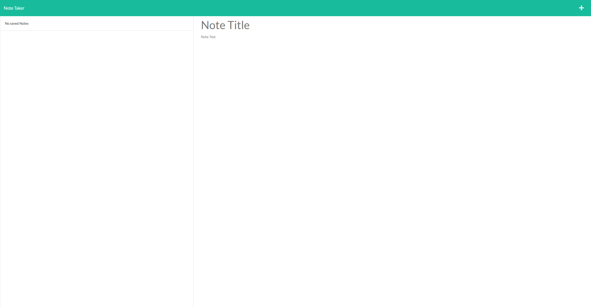
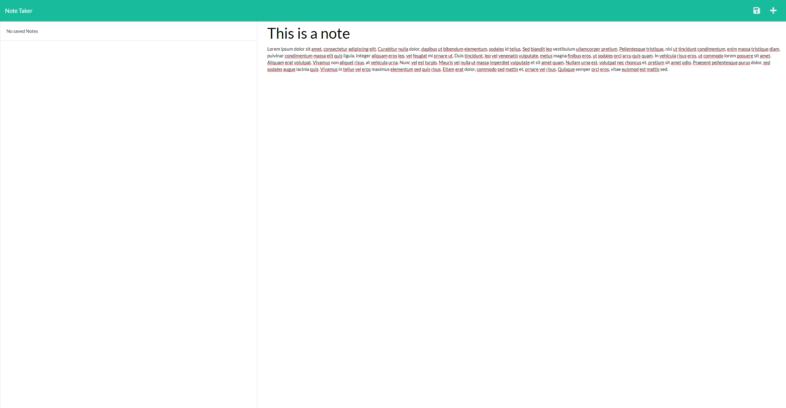
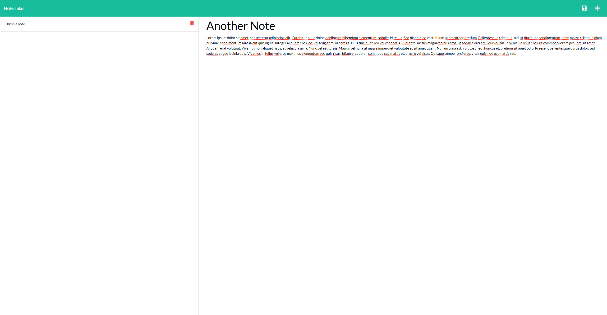

# Note Taker

## Description
The purpose of this application is to provide the user with simple reminders and notes application.  The user can enter a new note with a title and a text description.  They can then save that note to look at later.  The saved notes are available on the left hand side of page and are persistent.  The user can also choose to write another note by clicking on the plus sign or delete a note by clicking the trash icon next to the note they would like to delete.  It provides the user with an easy way to stay organized.
## Table of Contents
  * [Installation](#Installation)
  * [Usage](#Usage)
  * [Contribution](#Contribution)
  * [License](#License)
  * [Contact](#Questions)
## Installation
To install this application the user must download the code.  They will then need to install the dependencies.  To install express run the command 'npm i express'.  To install uuid for generating unique note ids, run the command 'npm i uuid'.  The application is deployed to Heroku.  It can be find with a link here: [deployed Heroku app.](https://young-everglades-94941.herokuapp.com/)
## Usage
When on the landing page, click 'get started' to be brought to the notes page.  On the notes page, enter the title of your note in the 'Note Title' section.  Then type the text of your note in the 'Note Text' section.  When you are satisfied with your note.  Click on the save icon in the top right side of the page.  That note will now populate the list on the left hand side.  To create another note, click on the plus sign on the top right hand side of the page.  To view a saved note, click on the note you would like to view in the list of saved notes and it will display on the page.  To delete a note, click on the red trash icon next to the note in the saved notes list and it will be removed from the page.
### No Notes

### Adding Note

### New Note

## Contribution
This an assignment I don't expect anyone to contribute.
## License
MIT License

Copyright (c) 2021, Shay Wagner

Permission is hereby granted, free of charge, to any person obtaining a copy
of this software and associated documentation files (the "Software"), to deal
in the Software without restriction, including without limitation the rights
to use, copy, modify, merge, publish, distribute, sublicense, and/or sell
copies of the Software, and to permit persons to whom the Software is
furnished to do so, subject to the following conditions:

The above copyright notice and this permission notice shall be included in all
copies or substantial portions of the Software.

THE SOFTWARE IS PROVIDED "AS IS", WITHOUT WARRANTY OF ANY KIND, EXPRESS OR
IMPLIED, INCLUDING BUT NOT LIMITED TO THE WARRANTIES OF MERCHANTABILITY,
FITNESS FOR A PARTICULAR PURPOSE AND NONINFRINGEMENT. IN NO EVENT SHALL THE
AUTHORS OR COPYRIGHT HOLDERS BE LIABLE FOR ANY CLAIM, DAMAGES OR OTHER
LIABILITY, WHETHER IN AN ACTION OF CONTRACT, TORT OR OTHERWISE, ARISING FROM,
OUT OF OR IN CONNECTION WITH THE SOFTWARE OR THE USE OR OTHER DEALINGS IN THE
SOFTWARE.
## Questions
GitHub: srwagner916 
Email: <srwagner916@gmail.com>
